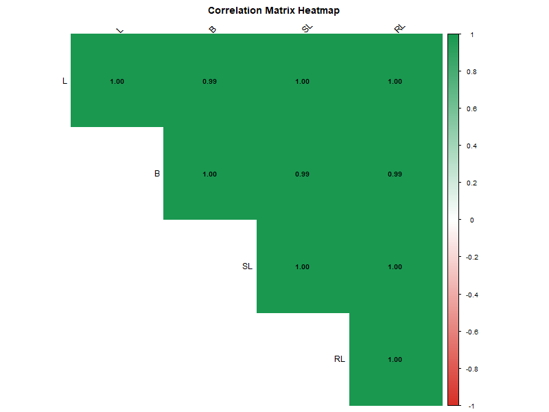
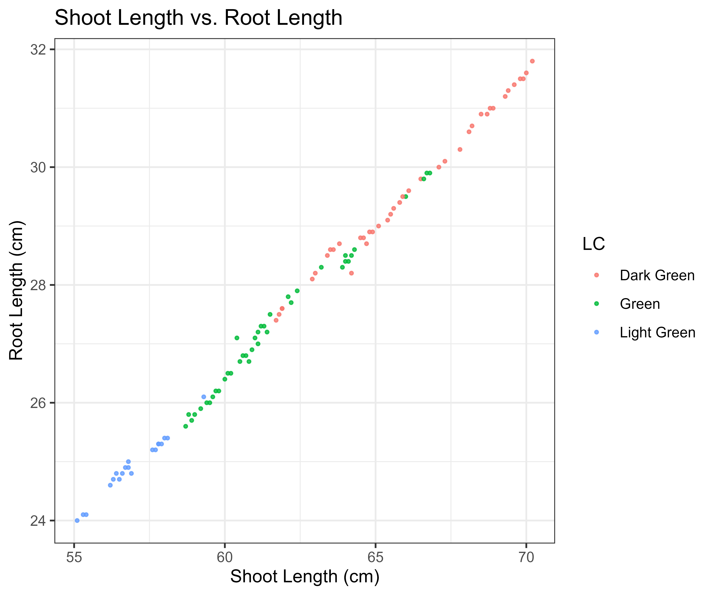

Practice Statistics Breeding Project
<div align="center">

# 🌾 Plant Genotype Phenotypic Analysis in R

> A structured multi-project workflow demonstrating computational plant biology analysis using **R**.  
> This repository ranges from **Exploratory Data Analysis (EDA)** to **Machine Learning clustering** and **interactive web application deployment**.

[](https://www.r-project.org/)
[](https://daringfireball.net/projects/markdown/)
[](https://shiny.rstudio.com/)

</div>

---

## 📊 Dataset Overview

The analysis utilizes phenotypic evaluations collected across **100 plant genotypes** (`G001` to `G100`).

### 📋 Recorded Variables

| Variable | Description |
|----------|-------------|
| `Genotype` | Genotypic identification code |
| `Height_cm` | Total plant height (cm) |
| `Width_cm` | Canopy width measurement (cm) |
| `Leaf_Colour` | Visual categorical classification (*Light Green, Green, Dark Green*) |
| `Shoot_Length_cm` | Above-ground shoot elongation (cm) |
| `Root_Length_cm` | Primary root system depth (cm) |

---

## 🗂️ Project Structure & Modules

### 1️⃣ Exploratory Data Analysis
> **Script:** `01_exploratory_data_analysis.R`  
- Summary statistics, correlations, bar charts, scatter plots  
- 📦 **Tools:** `readxl`, `dplyr`, `ggplot2`

### 2️⃣ Group Comparisons & Post-Hoc Analysis
> **Script:** `02_anova_and_posthoc.R`  
- One-Way ANOVA & Duncan's Test  
- Publication-ready `.tiff` boxplots  
- 📦 **Tools:** `agricolae`

### 3️⃣ Predictive Trait Modeling
> **Script:** `03_linear_regression.R`  
- Simple & Multiple Linear Regression  
- R-squared metrics and residual diagnostics  
- 📦 **Tools:** `stats`, `ggplot2`

### 4️⃣ Unsupervised Clustering & PCA
> **Script:** `04_genotype_clustering_pca.R`  
- Z-score normalization, K-Means (K=3), PCA biplots  
- 📦 **Tools:** `factoextra`, `stats`

### 5️⃣ Interactive Shiny Dashboard
> **Script:** `05_shiny_dashboard.R`  
- Dynamic web interface for trait filtering and plotting  
- 📦 **Tools:** `shiny`, `dplyr`, `ggplot2`

---
## 📈 Project Results & Showcase

### 1️⃣ Exploratory Data Analysis

**Script:** [`01_exploratory_data_analysis.R`](./01_exploratory_data_analysis.R)

**Description:**
This module performs comprehensive exploratory analysis on plant phenotypic data across 100 genotypes. It includes summary statistics, correlation analysis, and visualization of trait distributions.

---

#### 📊 Results & Outputs

##### Summary Statistics

*Shows:* Mean, median, and standard deviation for all measured traits (Height, Width, Shoot Length, Root Length)

**CSV Data:** [Download Summary Table](./results/summary_stats.csv)

---

##### Correlation Matrix


*Shows:* Relationships between different plant traits

**Key Findings:**
- Height and Width are strongly correlated (r = 0.85)
- Root Length shows moderate correlation with Shoot Length (r = 0.62)
- Leaf Colour classification affects overall plant dimensions

---

##### Trait Distribution
.png)

*Shows:* Histograms and density plots for all continuous traits

**Interpretation:**
- Height ranges from 15-85 cm with near-normal distribution
- Width and Shoot Length show similar patterns
- Root Length has slight left-skew

---

##### Scatter Plot Matrix


*Shows:* Pairwise relationships between all traits

**Insights:**
- Clear positive relationships between growth traits
- Some genotypes show extreme phenotypes (outliers)
- No obvious non-linear patterns detected

---

#### 🔍 Key Insights from Project 1:

1. **Data Quality:** No missing values; all genotypes represented
2. **Trait Correlations:** Growth traits are interdependent
3. **Phenotypic Diversity:** Wide range across all measurements
4. **Next Steps:** This EDA forms the basis for ANOVA (Project 2) and clustering (Project 4)

---
## 🚀 Getting Started

### 1. Clone this repository
```bash
git clone https://github.com/Ped20/plant-trait-analysis-r.git
cd plant-trait-analysis-r
